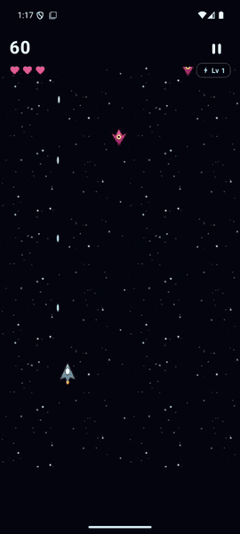
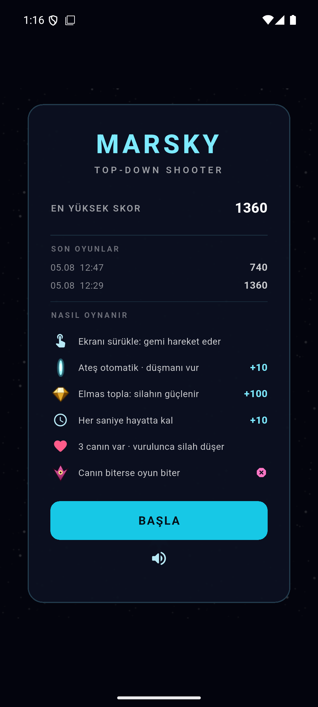
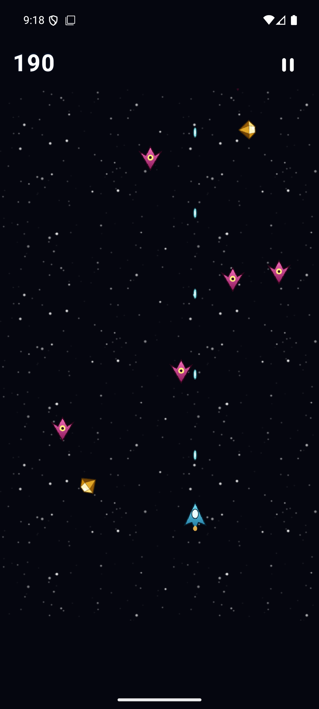
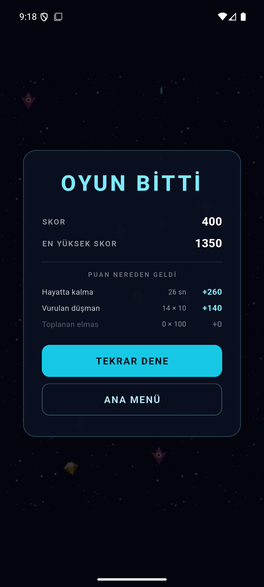

# MARSKY — Flutter & Flame Case Çalışması

[](https://github.com/icengizhan/marsky_shooter/actions/workflows/ci.yml)

Flutter ve **Flame** oyun motoruyla geliştirilmiş 2D top-down shooter.
Tüm oynanış Flame Component System üzerinde çalışır; Flutter widget'ları yalnızca
menü / HUD / duraklat / oyun bitti ekranlarında (`game.overlays`) kullanılır.

<p align="center">
  
</p>

<p align="center"><em>Android emülatöründe gerçek oynanış kaydı — ana menü, sürükleme ile
kontrol, otomatik ateş ve toplanabilir elmaslar.</em></p>

| Ana Menü | Oynanış | Oyun Bitti |
|---|---|---|
|  |  |  |

---

## Nasıl Oynanır

- **Ekranın herhangi bir yerinde sürükle** — gemi parmağını yumuşak bir gecikmeyle takip eder
- **Ateş otomatiktir** (0,22 saniyede bir mermi)
- Düşmanlar yukarıdan, oyuncuya doğru **açılı** iner — vurmak için yatayda hizalanmak gerekir
- **Bir düşmana çarparsan oyun biter** (can yok, tek temas)
- **Geri tuşu bir kademe yukarı çıkarır:** oynanış → duraklat → ana menü → çıkış
- Uygulama arka plana alınırsa oyun **otomatik duraklar** (gelen arama yüzünden haksız ölüm olmaz)

### Puan

| Kaynak | Puan |
|---|---|
| Hayatta kalınan her saniye | +10 |
| Vurulan düşman | +10 |
| Toplanan elmas | +100 |

Elmas en değerli kaynak: onu almak için güvenli konumundan çıkıp düşmanların arasına
girmen gerekir — oyundaki tek gerçek risk/ödül kararı.

Zorluk her 15 saniyede artar (düşman oluşma aralığı ×0,88), ama 0,25 saniyelik bir tabanın
altına inmez; oyun oynanamaz hale gelmez.

---

## Çalıştırma

Gereksinim: **Flutter 3.44+** (Dart 3.12+).

```bash
flutter pub get

flutter run -d chrome            # en hızlı iterasyon
flutter run -d <android-cihaz>   # hedef platform
```

```bash
flutter analyze                  # statik analiz — sıfır uyarı olmalı
flutter test                     # tüm test paketi
flutter build apk --release --split-per-abi   # teslim APK'ları (~16 MB / ABI)
```

Oyun **dikey (portrait)** moda kilitlidir ve 480×800 referans çözünürlüğe göre kurgulanmıştır;
sabit çözünürlüklü kamera sayesinde her ekran boyutunda aynı oynanış alanı gösterilir.

> **Not:** Ses `flame_audio` üzerinden çalışır ve masaüstü/web'de güvenilir değildir.
> Ses testi Android'de yapılmalıdır. Masaüstünde sessizlik bir hata değildir.

---

## Teknoloji

| Katman | Seçim |
|---|---|
| Oyun motoru | **Flame 1.38** — `FlameGame`, `HasCollisionDetection`, `ParallaxComponent` |
| Durum yönetimi (oyun dışı) | **Riverpod 3.4** — yüksek skor, skor geçmişi, ses ayarı |
| Durum yönetimi (oyun içi) | `ValueNotifier` — anlık skor, oyun durumu |
| Kalıcılık | `shared_preferences`, `KeyValueStore` arayüzünün arkasında |
| Test | `flame_test` + `mocktail` |

Oyun **içi** ve **dışı** state'in ayrılması bilinçlidir: skor saniyede onlarca kez değişir,
Riverpod üzerinden akıtılsa her değişimde widget ağacı yeniden kurulur ve kare hızı düşer.
Gerekçelerin tamamı → **[ARCHITECTURE.md](ARCHITECTURE.md)**

---

## Proje Yapısı

```
lib/
├── core/           → sabitler (GameConfig: tüm ayarlanabilir sayılar tek yerde)
├── domain/         → SAF DART: varlıklar + repository sözleşmeleri
├── data/           → sözleşmelerin shared_preferences uygulaması
├── game/           → Flame dünyası (Riverpod'u ve UI'ı bilmez)
└── presentation/   → Flutter overlay'leri + Riverpod provider'ları

tools/generate_assets.ps1   → tüm sprite ve sesleri ÜRETEN betik
```

Tüm görsel ve işitsel varlıklar bu betikle **kod ile üretilmiştir** — üçüncü parti telif
içermez. Yeniden üretmek için:

```powershell
powershell -ExecutionPolicy Bypass -File tools\generate_assets.ps1
```

---

## Case Gereksinimleri

Her maddenin kodda nerede karşılandığı ve **neden bu şekilde** yapıldığı
**[ARCHITECTURE.md](ARCHITECTURE.md)** dosyasında madde madde eşlenmiştir. Özet:

- ✅ Flame zorunlu — oynanışta tek bir Flutter widget'ı yok
- ✅ Component mimarisi — oyun mantığı `game/` altında 17 sınıfa dağıtılmış, kök sınıf yalnızca kompozisyon yapar
- ✅ Hitbox tabanlı çarpışma — `active`/`passive` ayrımı ile performanslı, sıfır manuel kesişim matematiği
- ✅ Riverpod ile oyun dışı state yönetimi
- ✅ Asset preload — `onLoad`'da bir kez, component'ler önbellekten okur
- ✅ Clean Architecture + SOLID — katmanlar tek yönlü bağımlı, `domain/` framework bağımsız
- ✅ 107 test, satır kapsamı **%92,1**, `flutter analyze` sıfır uyarı (strict-casts / strict-inference / strict-raw-types)
- ✅ Katman sınırları **testle** korunuyor — `domain/`'e Flutter import edilirse CI kırılır
- ✅ Object pooling, eşzamanlı düşman üst sınırı ve kare süresi ölçümü — sayılar
  [ARCHITECTURE.md §7](ARCHITECTURE.md)'de

`ARCHITECTURE.md` §4 ayrıca geliştirme sırasında **ölçümle bulunan** on iki gerçek problemi ve
çözümlerini içerir — hitbox'ların içi boş gelmesi, sesin oyunu test edilemez kılması, Android
ses odağının çalınması, puanın %88'inin tek kaynaktan gelmesi, asenkron `onLoad`'ın senkron
test döngüsünü kilitlemesi, testlerin kırılganlığı, widget testlerinin yakaladığı iki hata,
açılıştaki beyaz parlama, skor kaydını kaybeden `dispose` yarışı, gemi hareketinin kare
hızına göre farklı davranması, ana menüde geri tuşunun ölü kalması ve her ateş sesinin yeni
bir ses oynatıcısı kurması.

Her biri **ölçümle** bulundu ve her birinin **kırmızıya döndüğü doğrulanmış** bir regresyon
testi var — testlerin gerçekten ayırt ettiği, eski koda geri dönülüp sınanarak kontrol edildi.
